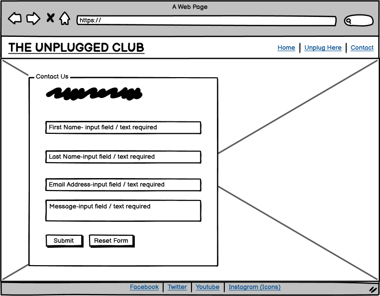
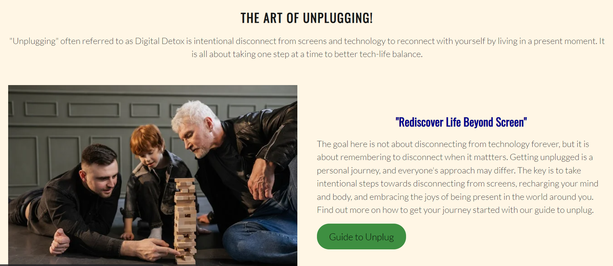

# THE UNPLUGGED CLUB

### [The live website is avaiable here](https://gayatrig19.github.io/the-unplugged-club/index.html)

# Purpose
This project is the static website focused on creating awareness about digital wellbeing and importance of getting away from screens once in a while. It aims at showing people that digital wellbeing can be achieved one step at a time. [The Unplugged Club](https://gayatrig19.github.io/the-unplugged-club/index.html) provides users with the guide and benefits of getting unplugged and what it is all about. 
- The core purpose here is to remind people that in the midst of constant notifications and distractions, it is essential to carve out moments of stillness, reflection, and genuine human interaction. It reflects on living life in a moment, reclaiming yourself and enjoying that "me time" without devices around. The website focuses on ideas of taking small steps towards spending time away from devices and screens and getting more mindful living life to fullest. The website uses clean, simple design with earthy colors and images that showcases the energies of living life beyond screens.

- The website is built using HTML and CSS as a Milestone Project#1 for the Code Institute's Full Stack Software Development Course.

------
# UX Design
## User stories
### As a **first time user**

- I want to easily understand the main purpose of the site and learn more about the topic.
- I want to be able to easily navigate through the site and find content.
- I want to find ways to join the club community and follow the community on different social media platforms.

### As a **returning** and a **frequent user**

- I want to find in-depth up-to-date information about the topic.
- I want to join the community.
- I want to contact the organisation to request additional information.

### All the users want to be able to access and view the website comfortably on mobile and tablet devices.

----
## Structure
### Home Page
- Introduces the club community , the purpose and "why it matters" on the first screen.
- Provides the complete overview of the topic: each page of the website is represented by it's own block.
- Grabs user's attention through images with effects and clean design to easily allow the user to navigate through information.

### Unplug Here Page
- Provides users with the topic purpose and detailed guided steps to follow.
- Grabs user's attention through design and images that outlines information to be conveyed.
- Includes animation effects for more attractive design.

### Contact Page
- Allows the user to join the club and get access to in-depth updates about community and content.
- Provide a simple and accessible way to join the club.
  
----

## Design

### Wireframes
#### **Large to Medium Screen Size**

### **Home Page**

### **Unplug Here Page**

### **Contact Page**
 

### **404Error Page**

#### **Small Screen Size**

### **Home Page**
 

### **Unplug Here Page**

### **Contact Page**

### **404Error Page**
 

### Typography

- [Oswald](https://fonts.google.com/specimen/Oswald) was chosen for logo and headings as it can be combined easily with other fonts. It is attractive and amenable for the heading content on site. Because it is slightly elongated, it brings contrast to a typography combination. With website consideration it was best suited as it gives both modern and a serious touch to the content throughout on pages.

- [Lato](https://fonts.google.com/specimen/Lato) was chosen for body text as it is light and easy to read.

### Images

- The images in this project are sourced from [Pexels](https://www.pexels.com/). They were specifically selected to correlate with the main purpose of the website and to give user a imagery representation for the content to increase impact of the design.

### Visual Effects

####  Overlay Texts and Shadows 
- As the website contains lots of high quality images for imagery purpose, it was important to add volume and make the content easier to perceive so the viewers are not distracted by the background rather are more focused on foreground information.
- The hero image on home page and on unplug here page contains overlay text to keep user focused on the purpose of the website.
- Each block of section is designed with effects to give website a more refined and clean look.
- The images are given effects for letting user get the feel of the website and relate to the content with some entertainment.

####  Benefits section, Guide to unplug section and Contact form Hover effect
- The  benefits section on home page, guide section on unplug here page and the contact form includes the hover effect to make the experience more interactive.
- When the user hovers over the blocks on benefits section and guide section, a transition effect is experienced.
- When the user engages with the input fields or hovers over, its border colour changes to sky blue to subtly highlight the item without compromising legibility.

----

# Features
## Existing Features

### Navigation bar
- The nav bar is shown on every page, with logo on the left and navigation menu on the right side of the screen for larger to medium screen sizes. The logo and navigation menu shifts to the center of the screen with decreasing screen size while maintaining the accessibility and consistency in website layout design. 
- The nav bar includes: page logo, and three links: Home, Unplug Here and Contact. It allows the user to easily navigate through the page. The logo and links are always responsive regardless of the screen sizes making it easy to find.
- The logo includes the link to make the design more interactive and easy for user to jump back to home page whenever one feels like.
  

### Home page image
- This is a main image for the home page. It evokes feelings of enthusiasm, liveliness, and vitality capturing the essence of life in it's most exhilarating form. The image includes a text overlay which indicates that the goal of the page is to improve digital wellbeing of the user and motivates user about getting away from screens once in a while to live life to fullest.
- The aim of the image is to instantly let the user know the true colors of life lived outside of the digital and screen world. The overlay text on the image tells user what content to expect on the page.
  

### Welcome to the Unplugged Club- section within "home" page
- This section has a brief explanation of the goal of the unplugged club website. It explains what the page is about and why getting unplugged matters. It includes a link to "contact" page.
- It encourages the users to take steps towards living life beyond screens and improve the tech-life balance by taking one step at a time. The aim of the section is let user know they are not on their own in this journey. The link to "Contact" page is there to help user make their life better in the journey of digital detox.
  

### Benefits- section within "home page"
- This section includes the benefits of getting unplugged. It motivates user to live more productive life by taking smaller steps towards better tech-life balance. It includes advantages of taking break from screens and how it can help in a better mental and social wellbeing.
- This section consist of image in blocks with overlay text. When user hovers over the each of the text blocks, a transition effect gives more feel to the design making it more interactive for the user. This effect is not experienced on smaller screens for the purpose of consistency and accessibility.  

### The Art of Unplugging- section within "home page"
- This section explains briefly what is unplugging and why it matters. 
- It allows the user to understand the main focus of the page and therefore what contents to be expected in the further sections. It also reminds user how the journey of unplugging can differ for everyone. It includes link to the "Unplug Here" page which takes user to the guide for taking steps towards digital wellbeing. The link to "Unplug Here" page is a start towards journey of digital detox making it easier for user to not get overwhelmed and taking one step at a time.

### Footer
- Similar to the navigation bar, the footer shows exactly the same on every page in the website. It includes four links to connect with The Unplugged Club community through social media.
- These links will open in new tabs, so that the user doesn't leave the website page too soon.
- The consistent design provides better user experience. Joining the community on social media will not only encourage the user to stay connected but also allows to enter a community of like minded people.

### Unplug Here Page
- This page includes the guide for getting unplugged. User can navigate to the page through clicking on the "Unplug Here" link in the navigation bar or through the link in the section on home page.
- This section consists of three card boxes. Each one of these takes user through the steps to taking time away from screens and social media once in a while in a simple way, so that users can focus on one step at a time. 
- The main image used for this page has a overlay text that informs user the page includes guided steps and illustrates a message of taking this journey one step at a time. The image was included to give the user more lively experience and encourage user to take steps towards the journey of living life in a moment.
- This image is universal for both desktop and mobile user.
  

- The three card boxes with images on top and content followed is designed to convey the steps to the user in descriptive way. This will give user a idea of how the guide can be followed in their own way without getting overwhelmed.
- Each of the boxes includes a general step with explanation on how the goal can be achieved with steady pace.
- The guide steps are kept user-friendly so that it doesn't discourage them towards starting the journey. It is achieved by including each step with the end goal of taking one step at a time.
- The value of each content with image is that the user will see that they don't need to invest financially to start the journey towards getting unplugged. It also tells user the activities they can do whilst on this journey and that they don't need to completely get off the grid rather the digital wellbeing can be achieved taking a certain period of time away and indulging in a more productive and mindful life.
- The steps are included as such if the user is confused on where to start from, they don't need to search over the internet but they can continue doing what makes them happy when away from screens.
- The hover effects on each of the boxes allows user to navigate through with amusement. When user hovers over each of the card boxes a transition of card takes place which makes it standout from rest of the card boxes.
    

### Contact Page
- This page includes a contact form. Users can get to this page by clicking "Contact" link in Navigation bar from any other page or by clicking the "contact us" link provided in welcome section on home page.
- The users will need to provide their: first name, last name and e-mail address before submitting a message. All fields are required.
- Users can provide any details about their way of getting unplugged, ideas on how one can achieve it and activities that are relevant to the goal, if they would like to be mentioned on the website.
- In the contact form, each input field when hover changes the border color to skyblue. The buttons when clicked gives a white background effect. This was included for more engaging user-experience.
- The contact form on submission takes user to code institute's form dumb where user can see the details entered.
  

### 404 ERROR PAGE NOT FOUND
- This page will show to user if a wrong link for the page is entered.
- The design for the page is simple stating the message and what can be the possible reason of the error.
- The benefit of the page is that customer gets a clear instructions with the link to go back to home page. Here, user won't need to use the browser's back button and can navigate through website without leaving it.
  

### Features left to implement
- Contact form processing: Currently , on submission of the Contact form, the data goes to the form dump, so the input is not being processed or stored. With the knowledge of SQL and Python, the input could be stored, processed and analysed and used to provide the user with a personalised user-experience.
- Events Details: Currently, the website does not have any events page where user can find events taking place around for activities whilst on the journey. This can help user get more socialised offline with friends and families.

## Testing

### Responsiveness
- The site is designed to be flexible, fluid and responsive on all screen sizes. Website has been checked for responsiveness through Chrome Development tools. In order to do this, the following steps have been taken:
  1. Open the browser
  2. Navigate to The UNPLUGGED CLUB website <https://gayatrig19.github.io/the-unplugged-club/>
  3. Right click anywhere on the page and got to "Inspect" to open Development Tools.
  4. click on drop down menu: "Dimensions: Responsive" and choose "Responsive"
  5. Drag the side of the screen and change screen size, making sure the website looks good from 320px and up. Here, make sure there is consistency in design of the website on every screen size from small(mobile devices) to larger(desktop) and no scorll bar is showing for layout of site.
   
   - Expected Result: Each page is responsive and user friendly when viewing the website on small and large screens.The pages have no design or accessibility issue in any of the screen sizes form 320px and up.
   - Actual Result: After using media queries and flexbox to home page and unplug here page, website is responsive with no scroll bar showing, the content is accessible to user to read and the images are not appearing stretched. Website is user friendly on small to large screen sizes.
  
- The following devices are used to check responsivess:
    - Iphone 12
    - Samsung Galaxy S20 FE 5G
     - One Plus Nord CE
     - Apple Ipad Pro 12.9
     - Microsoft Surface Pro
     - Moto G5
   
### Accessibility

Each page is checked with the help of WAVE Accessibility tool (<https://wave.webaim.org/>)

Each page passes accessibility test with no error for: 
     - contrast
     - aria- labels for users who use screen-readers
     - alternative text as a function for screen readers or in events if the images don't load
     - structural elements- for users of assistive technology as well as visual and semantic meaning
     - language of the document for screen readers
  
- Accessibility Test result for each page is as follows:
   1. [Home Page Result](assets/images/readme/home_accessibility.png)
   2. [Unplug Here Page Result](assets/images/readme/unplug_accessibility.png)
   3. [Contact Page Result](assets/images/readme/contact_accessibility.png)

### Manual Testing
Manual testing is performed to ensure website performs well on different browsers and devices.
 - Browsers
    - Chrome
    - Safari
    - Microsoft Edge
    - Firefox
        * Issue: The footer sticked to the content appearing a whitespace when viewed on Safari
        * Fix: I have changed the height to auto for footer so that it fills up the space when viewed on different browsers. The fix has been successful.
 - Devices
     * Iphone 12
     * Samsung Galaxy S20 FE 5G
     * One Plus Nord CE 
     * Apple Ipad Pro 12.9
     *  Microsoft Surface Pro
     *  Moto G5
- The website was fully functional on all the devices and no issues were detected.

### Lighthouse
- HOME PAGE(desktop/mobile)
  
  

- UNPLUG HERE PAGE(desktop/mobile)
  
  

- CONTACT PAGE(desktop/mobile)
  
  

 ### Functional Testing
 - Navigation Bar Links
     * All links are checked from each page to make sure they take user to correct page. All links works as expected.
  
  |NAVIGATION LINK| DESTINATION PAGE|
  |---------------|-----------------|
  |Home           | index.html      |
  |Unplug Here    | unplug.html     |
  |Contact        | contact.html    |
     
- Links within the narrative
      * Internal Links are checked to make sure they take user to correct page. All links work as expected.
      * External Links when clicked on are checked to make sure they open in new tab and takes user to correct page. All links work as expected.     

    | LINK(location)                                  | DESTINATION PAGE       | PAGE OPENS IN NEW TAB|
    |-------------------------------------------------|------------------------|---------------------|
    |Contact (home page/welcome section)              |  contact.html          | no- as expected
    |Unplug Here(home page/art of unplugging section) |  unplug.html           | no- as expected

- Footer Links
     * All social media links are checked from each page. All links works as expected, take user to correct page and opens in new tab.

    | SOCIAL MEDIA LINKS/ICONS   | DESTINATION PAGE            | PAGE OPENS IN NEW TAB|
    |--------------------------- |-----------------------------|----------------------|
    | Facebook icon              | https://www.facebook.com    | yes- as expected
    | Twitter icon               | https://www.twitter.com     | yes- as expected
    | Youtube icon               | https://www.youtube.com     | yes- as expected
    | Instagram icon             | https://www.instagram.com   | yes- as expected
   
### Validator Testing
- HTML Validation
  * No errors were found when passing through the official W3C Validator
   
- CSS Validation
  * No errors were found when passing through the official Jigsaw W3 Validator
   

### Fixed Bugs
- In initial testing, footer design was not responsive when viewed on Safari. The footer appeared sticky with content creating a whitespace underneath. It was fixed by setting height to auto. The fix was a success and the website works as expected on browsers and devices.

### Unfixed Bugs
- No bugs where detected while final testing of the website on browsers and devices(small, medium and large screen sizes). All the bugs were fixed in the initial testing of the website. All pages are fully functional and responsive to the browers and devices. The consistency in design is maintained throughout.

## Version Control
The website was developed through Codeanywhere IDE.

Code has been pushed to repository on Github with following git commands:
- git add . - to add files ready to commit
- git commit -m "message" - to commit the code to loacl repository ready to be pushed
- git push - final command used to push committed code to remote repo on Github

## CLONING THE REPOSITORY

1. Navigate to the GitHub Repository 'gayatrig19/the-unplugged-club'
2. Click 'Code' drop down menu - a green button shown right above the file list.
3. Copy the URL of the repository using 'HTTPS', 'SSH'or Github CLI.
4. Open Git Bash.
5. Change the current working directory to the location where you want the cloned directory.
6. Type 'git clone', and then paste the URL copied earlier.
7. Press enter to create local clone. A clone of the repository will now be created.

- For more details on how to clone the repository in order to create a copy for own use refer to the site: <https://docs.github.com/en/repositories/creating-and-managing-repositories/cloning-a-repository>

## FORKING

1. Navigate to the GitHub Repository 'gayatrig19/the-unplugged-club'
2. Click 'Fork' located towards top right corner.
3. Select 'owner' for the forked repository from the dropdown menu under 'owner'.
4. It will create forked repo under the same name as original by default. But you can type a name in 'Repository name' or add a description in 'Description' box.
5. Click on 'Create fork'. A forked repo is created.

- Forking allows you to make any changes without affecting original project. You can send the suggestions by submitting a pull request. Then the Project Owner can review the pull request before acepting the suggestions and merging them. 
- When you have fork to a repository, you don't have access to files locally on your device, for getting access you will need to clone the forked repository.

## DEPLOYMENT
- The website was deployed to Github Pages.
1. Go to GitHub repository.
2. Click on 'Settings'.
3. Click on 'Pages'(tab on the left sidebar).
4. Scroll to 'Build and deployment'/'Source' section.
5. Find the sub-section 'Branch'.
6. From the drop-down menu 'none'/'select branch' and choose source 'main' (or 'master').
7. Click 'Save'
8. Wait until you can see a link for deployed page within GitHub Page section. This can take a while. Once the page updates you will see a message:
      Your site is live at <https://gayatrig19.github.io/the-unplugged-club/>  

# Technologies
- HTML - used to create the main structure of the website.
- CSS - used to style the website.
- [Codeanywhere](https://app.codeanywhere.com/) IDE to develop the website.
- [GitHub](https://github.com/) to host the source code and GitHub Pages to deploy and host the live site.
- Git to provide the version control to commit and push code to the repository.
- [Google Fonts](https://fonts.google.com/) for typography.
- [FontAwesome](https://fontawesome.com/) v5.15.4 for icons.
- [Google Chrome Dev Tools](https://developer.chrome.com/docs/devtools/) for inspecting,debugging pages and testing layouts.
- [Pixelied](https://pixelied.com/) to convert .jpg images into .webp to reduce storage and enhance the website performance.
- [Pexels](https://www.pexels.com/) - used to source the images for the website.
- [TinyJPG](https://tinyjpg.com/) to optimise images for website.
- [Favicon.io](https://favicon.io/) to create the website favicon.
- [Balsamiq](https://balsamiq.com/) to design the wireframes for the website.
- [Color Palettes](https://colorpalettes.net/) to source colour palette for the website.
- [Am I Responsive](http://amiresponsive.blogspot.com/) to create the Mockup image in this README.
- Google Chrome's[Lighthouse](https://developers.google.com/web/tools/lighthouse/) to test accessibility for desktop and mobile devices.
- [WAVE](https://wave.webaim.org/) evaluation tool to test the website for accessibility to individuals with disabilities.
- [W3C HTML Markup Validator](https://validator.w3.org/) to validate the HTML Code.
- [W3C Jigsaw CSS Validator](https://jigsaw.w3.org/css-validator/) to validate the CSS Code.
- Code Institute's Codeanywhere Template to generate the workspace for the project.

 

 
     

 

 

